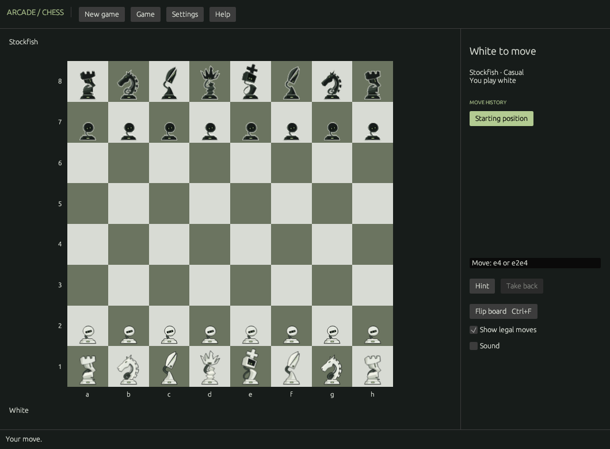

# Omarchy Chess

Open a board. Choose a side. Play.

A native Linux chess app written in Rust, for offline games against Stockfish or a friend at the same computer. It follows your active Omarchy colours and resumes your unfinished game.

**Development preview.** Independent community project; not an official Omarchy component.



[Compact light appearance](docs/preview-light.png)

## Features

- Computer play as White or Black with four strength settings; local two-player play.
- Click, drag, arrow-key navigation and typed algebraic or coordinate moves.
- Castling, en passant, all promotions, checkmate, stalemate, automatic draws, draw claims and resignation.
- Move history with read-only review, highlights, hints, takebacks, guides and board flipping.
- Atomic autosave, single-instance protection, archived games and PGN import/export.
- Live Omarchy colours with a built-in fallback palette.

No Python runtime, account, telemetry, online service or runtime downloads. The Arch package includes a pinned Stockfish build.

## Run from source

Requires a Linux desktop, Rust (the toolchain is pinned in `rust-toolchain.toml`), a C linker, pkg-config and the system libraries listed in `packaging/PKGBUILD`. File dialogs use the desktop's XDG portal.

```bash
git clone --branch feat/native-chess-preview https://github.com/tcballard/omarchy-chess.git
cd omarchy-chess
cargo build --release --locked
./target/release/omarchy-chess
```

Install Stockfish using your distribution, or obtain an executable from [Stockfish's official downloads](https://stockfishchess.org/download/). The app checks PATH and `/usr/games/stockfish`; Settings also has an executable picker. To choose a specific executable:

```bash
OMARCHY_CHESS_ENGINE=/absolute/path/to/stockfish ./target/release/omarchy-chess
```

The variable is one executable path, never a shell command. A fresh source build without an engine opens directly in local play. Local play works independently; failed computer requests expose **Retry engine**.

## Arch / Omarchy

CI builds development packages. Download `rust-arch-preview` from a passing [Actions run](https://github.com/tcballard/omarchy-chess/actions), extract and inspect it, then install:

```bash
sudo pacman -U ./omarchy-chess-*.pkg.tar.zst
```

The package includes Stockfish and resolves sound playback dependencies automatically. These are development artifacts, not a signed release channel. No AUR submission is required.

To build locally, install `base-devel`, `git`, `rust`, `pkgconf` and the dependencies in `packaging/PKGBUILD`. From a clean committed checkout:

```bash
./packaging/build-arch.sh
```

The script snapshots and checksums the exact source commit, then builds without installing or invoking sudo. The package includes a desktop launcher and icon. There is no separate Python rules package.

## Controls

| Action | Control |
|---|---|
| Select / move | Click twice or drag |
| Navigate board | Arrow keys; Enter/Space to select; Escape to clear |
| Type move | Move field: `e4`, `Nf3`, `O-O`, `e2e4`, `e7e8n` |
| New game | Ctrl+N |
| Import / export PGN | Ctrl+O / Ctrl+S |
| Take back / hint | Ctrl+Z / Ctrl+H |
| Flip / return live | Ctrl+F / Ctrl+L |
| Settings / sound | Ctrl+, / Ctrl+M |
| Help / quit | F1 / Ctrl+Q |

Computer takeback returns to your previous turn; local takeback undoes one ply. Threefold/fifty-move draws require a claim, including when available through an intended legal move. Fivefold repetition and the seventy-five-move rule end games automatically.

## Arcade consistency

Game, Settings and Help follow the [shared Arcade standard](docs/ARCADE_STANDARD.md). Sound defaults off and is remembered; Follow Omarchy can be disabled for the fallback palette. Finished games offer Play Again. Dragged pieces follow the pointer. The About screen shares the launcher icon, collection name and version.

## Files and compatibility

- Session: `${XDG_STATE_HOME:-~/.local/state}/omarchy-chess/session.json`.
- Settings: `settings.json` beside the session, preserved through package updates.
- Previous games: `archive/` in that directory, saved before replacement.
- Theme: `${XDG_STATE_HOME:-~/.local/state}/omarchy/current/theme/colors.toml`, checked every two seconds.
- Legacy Python-preview saves are imported and backed up before the first Rust write. Close the old app before launching Rust. An existing legacy `session.lock` prevents startup; remove a stale legacy lock only after verifying the old process is no longer running.
- Corrupt saves stay untouched until replacement archives a recovery copy. Write failures are shown in the app; export PGN to keep another copy.
- PGN imports accept one standard-chess game up to 1 MB and 2,048 plies, including custom starting FENs. Comments and variations are not retained; original files stay intact. Unfinished imports continue in local mode.

## Development

```bash
cargo fmt --check
cargo clippy --locked --all-targets -- -D warnings
REQUIRE_STOCKFISH=1 cargo test --locked --all-targets
```

Set `OMARCHY_CHESS_ENGINE` if Stockfish is not on PATH or in `/usr/games`. Without `REQUIRE_STOCKFISH`, the real-engine test skips when the engine is absent. CI also builds a release binary, captures a window under Xvfb and builds an Arch package.

See [DECISIONS.md](DECISIONS.md) for judgement calls, [verification](docs/VERIFICATION.md) for evidence and remaining desktop checks, and [architecture](docs/ARCHITECTURE.md) for the code map.

## License

GPL-3.0-or-later. See [LICENSE](LICENSE) and [THIRD_PARTY.md](THIRD_PARTY.md). Powered by shakmaty, egui and the separately installed Stockfish engine.

Desktop acceptance: [short test script](docs/DESKTOP_ACCEPTANCE.md).
